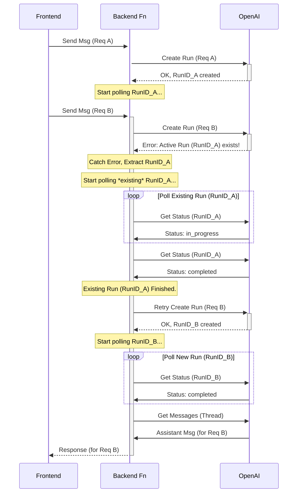

# Plan: Handle OpenAI "Thread already has an active run" Error

**Goal:** Prevent or gracefully handle the OpenAI API error "Thread already has an active run", which occurs when a new request is made while OpenAI is still processing a previous one on the same conversation thread.

**Analysis:**

*   **Root Cause:** The OpenAI API enforces that only one run can be active per thread at any given time. Sending a new request before the previous run finishes causes this error.
*   **Current Behavior:**
    *   The frontend has basic loading state (`isLoading`) but doesn't fully prevent issues if a backend run takes longer than expected.
    *   The backend currently crashes (returns non-2xx) when it receives this specific error from OpenAI, leading to a generic failure message on the frontend.

**Proposed Solution: Backend Retry/Polling**

This approach handles the limitation directly within the backend function (`supabase/functions/multi-agent-chat/index.ts`), making it more resilient.

1.  **Modify Backend Function:**
    *   Locate the section where a new run is created (around line 534: `fetch(\`https://api.openai.com/v1/threads/\${threadId}/runs\`, ...)`).
    *   Wrap this `fetch` call in a `try...catch` block.
    *   **Inside the `catch` block:**
        *   Check if the caught error from OpenAI specifically indicates an "active run" exists (e.g., by parsing `errorData.error.message` or checking `errorData.error.code`).
        *   **If "active run" error:**
            *   Log a warning indicating an active run was detected.
            *   Attempt to extract the ID of the *existing* active run (`existingRunId`) from the error message (Note: This might be brittle and depend on OpenAI's error format).
            *   Implement a **new polling loop** specifically for this `existingRunId`.
            *   Poll `GET /v1/threads/{threadId}/runs/{existingRunId}` periodically (e.g., every 2-3 seconds) until its status becomes terminal (`completed`, `failed`, `cancelled`, `expired`).
            *   Add a reasonable timeout (e.g., 2-3 minutes) to this inner polling loop.
            *   **After the existing run finishes:** Log that the previous run completed and then **retry** the original `fetch` call to create the run for the *current* request. Handle potential errors during this retry.
        *   **If other error:** Re-throw the error to be handled by the main function's error handling.
    *   **Outside the `catch` block (Original `fetch` succeeds):** Continue processing as normal.

**Diagram (Illustrating Backend Retry):**

**Pros & Cons:**

*   **Pros:** Handles the issue robustly on the server, smoother UX as the request eventually completes without user intervention.
*   **Cons:** More complex backend logic, increases function execution time, potential for hitting execution limits if waits are very long. Parsing existing run ID from error message can be brittle.

**Next Steps:**

1.  Implement the changes in `supabase/functions/multi-agent-chat/index.ts`.
2.  Deploy the updated function.
3.  Test by sending messages in quick succession to try and trigger the "active run" condition.