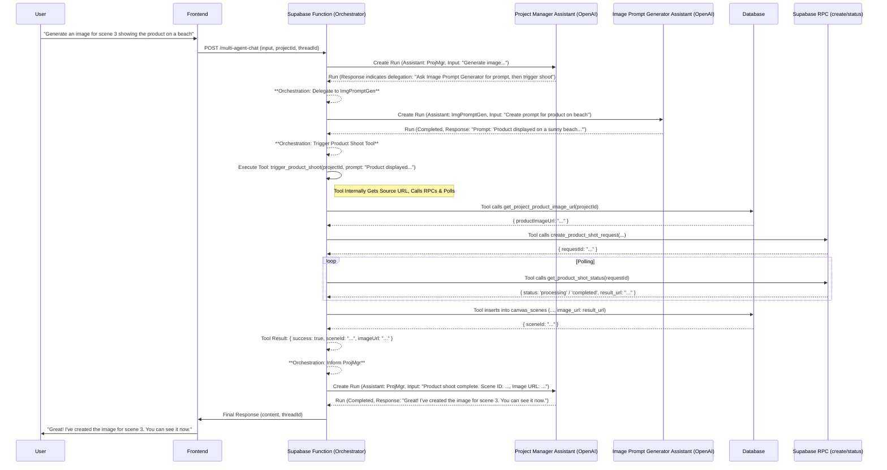

# Multi-Agent System Enhancement Plan

## 1. Goal

Enhance the existing multi-agent chat system for AI product video creation by introducing specialized agents for specific tasks (script writing, image prompt generation, scene description from text, scene description from image). This will be achieved using a "Project Manager" (Orchestrator) model, where the main assistant delegates tasks to specialized assistants. The plan leverages existing Supabase RPC functions (`create_product_shot_request`, `get_product_shot_status`) for image generation via the product shoot features.

## 2. Core Components & Changes

### 2.1. Database Schema Changes

Two primary changes are required: adding a main product image URL to projects and a description field to scenes.

**Migration SQL:**

```sql
-- Add main product image URL to projects table
-- This centralizes the primary product image used for generation.
ALTER TABLE canvas_projects
ADD COLUMN main_product_image_url TEXT;

-- Add description field to scenes table
-- This stores text descriptions, potentially generated by agents.
ALTER TABLE canvas_scenes
ADD COLUMN description TEXT;
```

### 2.2. Specialized OpenAI Assistants

Create four new OpenAI Assistants and store their IDs as environment variables (e.g., `SCRIPT_WRITER_ASSISTANT_ID`, `IMAGE_PROMPT_GENERATOR_ASSISTANT_ID`, etc.):

*   **Script Writer:** Focuses on generating and modifying video script content based on user prompts or project context.
*   **Image Prompt Generator:** Creates effective image generation prompts (for the product shoot tools) based on script content, scene descriptions, or user requests.
*   **Scene Describer (Text):** Generates textual descriptions for scenes based on script sections or user instructions.
*   **Scene Describer (Image):** Generates textual descriptions based on analyzing an image URL. **Requires Vision capabilities enabled in OpenAI settings.**

### 2.3. Project Manager Assistant (Orchestrator)

The existing `VIDEO_PROJECT_ASSISTANT_ID` will serve as the Project Manager.

*   **Updated Instructions:** Modify its instructions to:
    *   Understand the overall video creation workflow.
    *   Break down user requests into sub-tasks (scripting, prompt generation, product image generation, description).
    *   Identify when to delegate tasks to specialized assistants.
    *   Clearly indicate *which* assistant to delegate to and *what* information is needed.
    *   Know that image generation uses the project's `main_product_image_url`.
    *   Trigger appropriate tools directly when delegation isn't needed (e.g., `trigger_product_shoot` after getting a prompt).

### 2.4. Supabase Function (`index.ts`) Orchestration Logic

The main Edge Function (`multi-agent-chat/index.ts`) needs significant updates to handle the orchestration:

1.  Load all Assistant IDs from environment variables.
2.  The primary interaction loop runs with the Project Manager assistant.
3.  Analyze the Project Manager's response after each run.
4.  **If Delegation Indicated:**
    *   Parse the target assistant ID and task details.
    *   Gather necessary context (e.g., call `get_project_details`, `get_script`, `get_project_product_image_url`).
    *   Initiate a *new run* on the *same thread* using the *specialized assistant's ID* and provide specific task instructions (including image URL for Vision assistant).
    *   Poll this specialized run, handling its tool calls if any.
    *   Retrieve the result from the specialized assistant.
    *   (Optional) Store the result using a tool (e.g., `save_scene_description`).
    *   Initiate *another run* for the *Project Manager*, feeding it the specialized assistant's result.
    *   Poll this run and return its final response to the user.
5.  **If Tool Trigger Indicated (by Project Manager):**
    *   Parse tool name and arguments.
    *   Execute the tool (e.g., `trigger_product_shoot`).
    *   Feed the tool result back to the Project Manager via another run.
    *   Poll this run and return its final response.
6.  **If No Delegation/Tool Trigger:** Return the Project Manager's response directly.

### 2.5. Tools Definition

Update the tools available to the assistants within the Supabase function:

*   **Keep & Implement:**
    *   `create_new_script_tool`: Implement logic to generate/update `canvas_projects.full_script`.
*   **Keep:**
    *   `get_project_details`: Fetches project info.
    *   `update_project_title`: Updates project title.
    *   `get_script`: Fetches `canvas_projects.full_script`.
    *   `get_scene_image_url`: Fetches `image_url` from `canvas_scenes`. (Used by Scene Describer Image).
    *   `save_scene_description`: Updates `canvas_scenes.description`.
*   **Add/Revise:**
    *   `get_project_product_image_url`:
        *   *Input:* `projectId`.
        *   *Action:* Fetches `main_product_image_url` from `canvas_projects`.
        *   *Output:* `{ productImageUrl: "..." }` or error.
    *   `trigger_product_shoot`:
        *   *Inputs:* `projectId`, `prompt`, optional `referenceImageUrl`, optional `aspectRatio`, etc.
        *   *Action:*
            1.  Internally calls `get_project_product_image_url(projectId)` to get the source image URL.
            2.  Calls `create_product_shot_request` Supabase RPC with provided inputs and the fetched source URL.
            3.  Polls for completion using `get_product_shot_status` Supabase RPC.
            4.  Upon success, inserts a new record into `canvas_scenes` with the `projectId` and the `result_url` from the RPC status.
        *   *Output:* `{ success: true/false, sceneId: "...", imageUrl: "...", error: "..." }`.
*   **Remove:**
    *   `create_scene_image_tool`: The previous generic DALL-E tool is replaced by `trigger_product_shoot`.

### 2.6. Frontend Considerations

*   A UI mechanism will eventually be needed for users to set/update the `main_product_image_url` on the `canvas_projects` table. This is outside the scope of the initial agent backend changes but should be planned.

### 2.7. Data Migration Considerations

*   A one-time script or manual process might be needed to populate the `main_product_image_url` for existing projects in the `canvas_projects` table, perhaps using the image from the first scene or a default placeholder.

## 3. Orchestration Flow Diagram (Example: Image Generation)



## 4. Conclusion

This plan outlines the steps to enhance the multi-agent system by adding specialized assistants and integrating them with the existing product shoot functionality via Supabase RPCs. It requires modifications to the backend orchestration logic, database schema, and tool definitions.