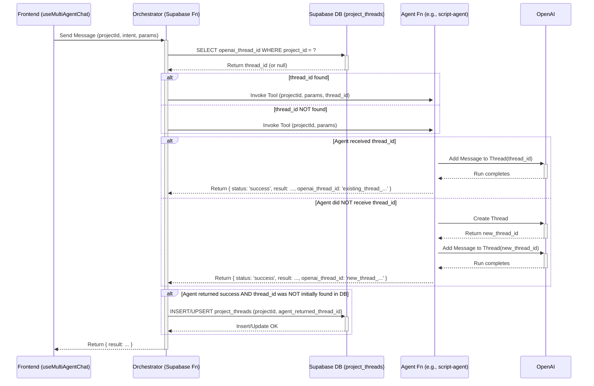

# Plan: Multi-Agent Chat Thread Persistence

**Goal:** Implement persistent, project-specific chat memory for the multi-agent system by correctly managing OpenAI Assistant threads.

**Problem:** The current implementation fails to maintain conversation history within a project session. The AI forgets previous messages because the OpenAI thread ID associated with a specific project (`projectId`) is not being consistently retrieved, used, and persisted across requests. Each interaction likely creates a new, isolated thread, losing context.

**Solution:** Centralize the management of OpenAI thread IDs in the backend, specifically within the `request-router-orchestrator` Supabase function. Use the `projectId` as the key to store and retrieve the corresponding `openai_thread_id`.

**Implementation Steps:**

1.  **Database Schema Change:**
    *   Create a new table in Supabase: `project_threads`.
    *   **Columns:**
        *   `project_id` (UUID, Foreign Key to `canvas_projects.id`, Primary Key or Unique Constraint)
        *   `openai_thread_id` (TEXT, NOT NULL)
        *   `created_at` (TIMESTAMPTZ, default `now()`)
        *   `updated_at` (TIMESTAMPTZ, default `now()`)
    *   **RLS Policies:** Ensure appropriate RLS policies are set for security (e.g., users can only access/manage threads related to projects they own/belong to, service roles for function access).

2.  **Modify Agent Functions (e.g., `script-agent`, `prompt-agent`):**
    *   **Input:** Update function signatures to accept `projectId`, `userRequest`, and optionally `threadId` in their arguments payload.
    *   **Logic:**
        *   If `threadId` **is provided** and valid: Use that thread ID for OpenAI Assistant interactions (adding messages, running the assistant).
        *   If `threadId` **is NOT provided** or invalid:
            *   Create a *new* OpenAI thread using the OpenAI API.
            *   Use the newly created thread for the current interaction.
        *   **Return Value:** Modify the function's return structure to consistently include the `openai_thread_id` used (whether existing or new). A suggested success structure: `{ status: 'success', result: { /* agent's primary output */ }, openai_thread_id: 'thread_...' }`. If a new thread was created, ensure this `openai_thread_id` is the new one. Error structure: `{ status: 'error', error: '...' }`.

3.  **Modify Orchestrator Function (`request-router-orchestrator`):**
    *   **Input:** Continue receiving `projectId`, `intent`, `parameters` from the frontend. **Crucially, ignore any `threadId` potentially sent by the frontend.**
    *   **Logic:**
        *   **Lookup Thread ID:** Before calling the target agent function, query the `project_threads` table: `SELECT openai_thread_id FROM project_threads WHERE project_id = $1 LIMIT 1;`.
        *   **Prepare Agent Call Arguments:**
            *   If a `threadId` is found in the database, include this `openai_thread_id` in the `arguments` object passed to the agent function.
            *   If *no* `threadId` is found, call the agent function *without* an `openai_thread_id` argument, letting the agent know it needs to create one.
        *   **Invoke Agent:** Call the appropriate agent function (e.g., `script-agent`) using `supabaseClient.functions.invoke()`.
        *   **Handle Agent Response:**
            *   If the agent call is successful (`invokeData.status === 'success'`):
                *   Extract the `openai_thread_id` returned by the agent.
                *   If the database lookup initially *failed* to find a thread ID (meaning the agent just created one): **Save the mapping** by inserting/upserting into `project_threads`: `INSERT INTO project_threads (project_id, openai_thread_id) VALUES ($1, $2) ON CONFLICT (project_id) DO UPDATE SET openai_thread_id = EXCLUDED.openai_thread_id, updated_at = now();`.
                *   Forward the agent's primary result (`invokeData.result`) back to the frontend.
            *   If the agent call fails (`invokeData.status === 'error'`), handle the error and forward appropriate information back to the frontend.

4.  **Modify Frontend (`use-multi-agent-chat.tsx`):**
    *   **Remove State:** Delete the `currentThreadId` state variable and associated `useState` hook (around line 77).
    *   **Remove Logic:** Remove any logic that sets, reads, or passes `currentThreadId` to the backend.
    *   **Simplify API Call:** Ensure the call to the `request-router-orchestrator` function (via `supabase.functions.invoke`) only sends necessary data like `projectId`, `intent`, and `parameters`. Do **not** send any `threadId`.

**Sequence Diagram:**

This plan ensures that each project maintains its unique conversation context within a dedicated OpenAI thread, managed reliably by the backend.