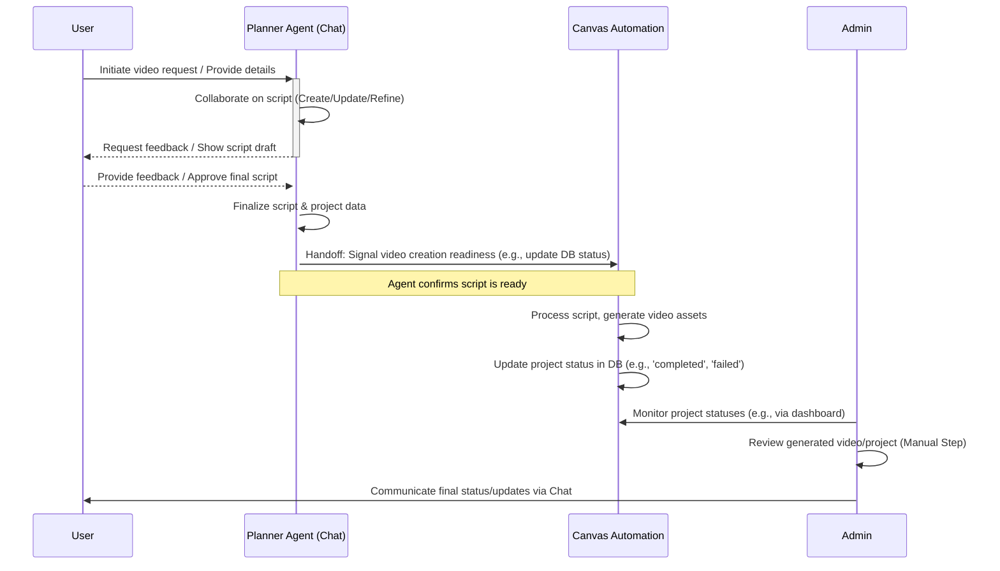

# Focused Planner Agent Workflow

This document outlines a revised workflow for the multi-agent chat system, focusing on dedicating a specific agent for planning and script management, followed by automated processing and manual admin updates.

## Proposed Workflow Steps

1.  **Initiation:** The user starts a request in the multi-agent chat interface, aiming to create a video.
2.  **Planner Agent Interaction:**
    *   A dedicated "Planner Agent" engages with the user.
    *   Its primary role is to collaboratively **define, refine, and finalize the video script** and associated project details (like scene descriptions, maybe target audience, tone, etc.).
    *   This involves back-and-forth conversation, script updates, and getting user approval on the final plan/script.
    *   Once the script is finalized and approved by the user, the Planner Agent's core task is complete for the *creative* phase.
3.  **Handoff to Canvas:**
    *   The Planner Agent **confirms** that the script is ready for production.
    *   It triggers the next stage by making the finalized script/project data available to the Canvas automation system. (The exact mechanism needs definition - e.g., updating a database status, calling a specific function).
4.  **Canvas Automation:**
    *   The Canvas system detects the "ready" project.
    *   It automatically processes the script and generates the video assets based on the finalized plan.
    *   Canvas updates the project's status upon completion or if errors occur.
5.  **Admin Oversight & Communication:**
    *   An Admin user monitors the status of projects within the system (likely via a dashboard showing statuses updated by Canvas).
    *   The Admin can manually review the generated video/project details.
    *   The Admin provides **manual updates** back to the user via the chat interface regarding the project's completion, potential issues, or next steps.

## Visual Representation (Mermaid Diagram)

## Key Changes & Considerations

*   **Agent Focus:** The chat agent is *only* responsible for the script/plan, not the full end-to-end process or direct video creation triggering.
*   **Clear Handoff:** Defines distinct points where responsibility transfers (Agent -> Canvas, Canvas -> Admin).
*   **Manual Admin Step:** Incorporates the manual review and communication step by the Admin.
*   **Database Interaction:** The Planner Agent still needs to interact with the database to store/update the script. The Canvas system reads from it, and the Admin likely views data from it. The previously observed database errors will need to be addressed for this workflow to function correctly at the handoff points.